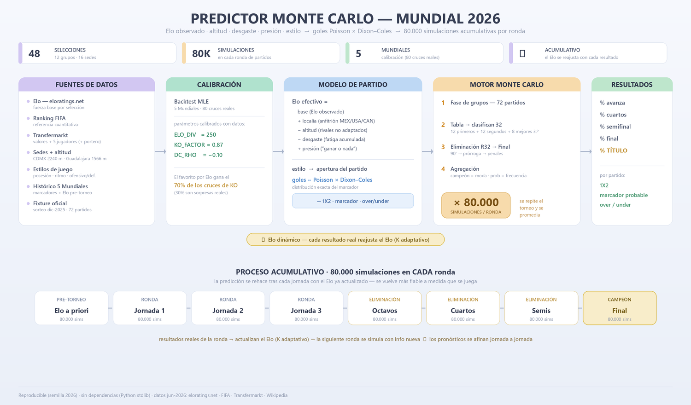
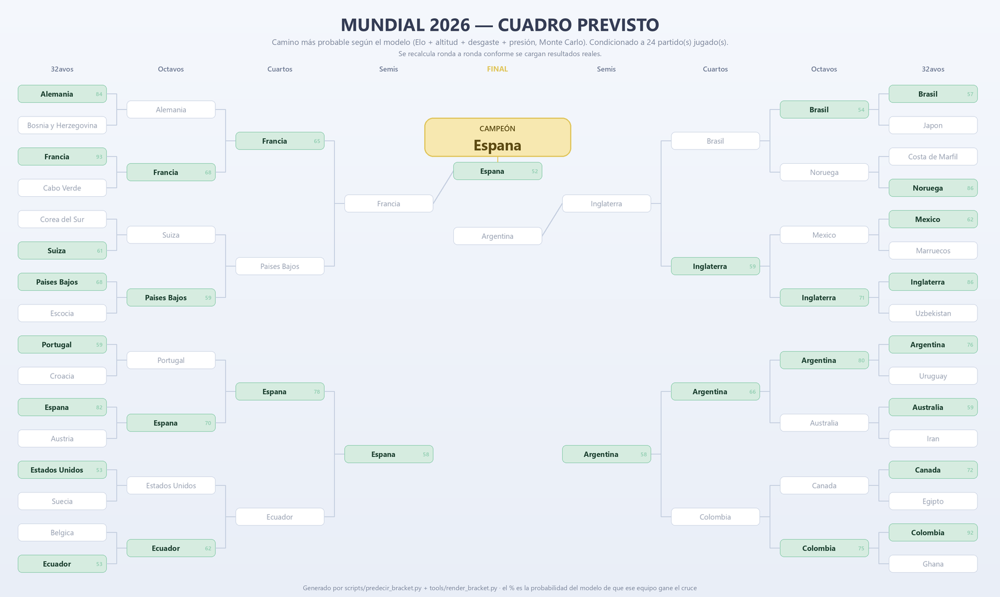

# Predictor Monte Carlo — Mundial 2026



Simulador probabilístico de la Copa Mundial de la FIFA 2026 (48 equipos, 12 grupos,
sedes en México, EE.UU. y Canadá). Estima probabilidades de avanzar, llegar a cada
ronda y ganar el título corriendo el torneo completo miles de veces.

El modelo parte de un **observable cuantitativo objetivo** (el Elo de
[eloratings.net](https://www.eloratings.net/)) y lo ajusta partido a partido por
**altitud**, **desgaste** y **presión**. Las predicciones se **recalculan
condicionadas a los resultados reales** que se van cargando conforme avanza el Mundial.

> El diagrama de arriba (fuentes de datos → modelo → Monte Carlo, y el bucle acumulativo)
> también está como vectorial en [docs/diagrama_arquitectura.svg](docs/diagrama_arquitectura.svg).
> Las imágenes PNG se regeneran con `python tools/render_arquitectura.py` y
> `python tools/render_bracket.py` (requieren Pillow; el modelo en sí no tiene dependencias).

## Uso rápido

```bash
# (Windows) el alias de la Store interfiere con "python"; usa la ruta del intérprete o py
python scripts/run_prediccion.py                 # 10.000 simulaciones, semilla 2026
python scripts/run_prediccion.py --sims 50000    # más simulaciones = más estable
python tests/test_modelo.py                       # pruebas (también con pytest)
```

Salidas: [data/prediccion_resultados.json](data/prediccion_resultados.json) (ranking
completo) y [docs/prediccion_resultados.md](docs/prediccion_resultados.md) (resumen).

Sin dependencias externas: solo la librería estándar de Python 3.10+.

## El modelo

Cada equipo tiene un **Elo base** observado (eloratings.net, independiente del ranking
FIFA, que se guarda solo como referencia). En cada partido se calcula un *Elo efectivo*:

```
elo_eff = elo_base
          + localía         (anfitrión jugando en su país: México / EE.UU. / Canadá)
          − penal_altitud    (jugar en altura por encima de la altitud a la que el equipo se adapta)
          − penal_desgaste   (fatiga acumulada; crece con cada partido y prórroga, se recupera con descanso)
          + bonus_presión    (última jornada de grupos, equipo obligado a ganar)
```

Los goles de cada equipo son **Poisson** independientes con media
`λ = GOAL_BASE · factor_goles · (1 + apertura) · exp(±GAMMA · ΔElo_eff / ELO_DIV)`, donde
`factor_goles = 1` en la fase de grupos y `= KO_FACTOR (<1)` en eliminatorias. El **Elo
fija el favorito**; el **estilo** y la **presión** fijan el *carácter* del partido (la
`apertura`: más/menos goles y varianza, sin cambiar quién gana). En eliminatorias
`KO_FACTOR < 1` cierra los partidos (calibrado con el histórico). Eliminatorias:
90′ → prórroga → penales.

Agregación sobre las N corridas: **campeón = moda**; probabilidades = **frecuencia**;
puntos de grupo = **media**.

### Factores
- **Altura**: las sedes mexicanas (CDMX 2240 m, Guadalajara 1566 m) penalizan a los
  no adaptados; México, Ecuador, Colombia, Sudáfrica e Irán apenas la sufren. El
  **fixture es el calendario oficial**: los 72 partidos de grupos llevan su
  emparejamiento, fecha y sede reales del calendario publicado el 6-dic-2025
  (ver `scripts/construir_fixture.py`).
- **Desgaste**: la penalización por fatiga es creciente, así que pesa más en cuartos,
  semis y final, y se agrava con prórrogas y poco descanso.
- **Presión "ganar o nada"**: en la 3ª jornada de grupos un equipo con ≤3 puntos recibe
  empuje y juega un partido más abierto.
- **Estilo de juego**: cada selección tiene atributos (posesión, ofensivo/defensivo,
  ritmo) que abren o cierran el partido (`data/estilos.json`).
- **Histórico**: `data/historico_mundiales.json` (cruces de los 5 últimos Mundiales)
  calibra el modelo vía `scripts/calibrar.py` (de ahí sale `KO_FACTOR`).
- **Mejora con el torneo**: carga resultados reales y vuelve a predecir (ver abajo).

## Predicción por partido

Distribución exacta de un partido (sin simular), con todo el contexto (Elo, altitud,
localía, estilo):

```bash
python scripts/predecir_partido.py id H1A            # un partido del fixture por su id
python scripts/predecir_partido.py vs Argentina Mexico
python scripts/predecir_partido.py jornada 1         # todos los pendientes de la jornada
```

Devuelve **1X2** (gana/empata/pierde), **marcador más probable**, **top-5 marcadores**,
**over/under 2.5** y goles esperados. Incluye la corrección **Dixon-Coles** (`DC_RHO`),
que ajusta los marcadores bajos (sube empates 0-0/1-1) respecto al Poisson puro.

## Predicción en vivo y Elo dinámico (conforme se juega)

```bash
python scripts/actualizar_resultados.py listar                 # ids de partido y pendientes
python scripts/actualizar_resultados.py grupo A1A 2 1          # marcador real de un partido
python scripts/actualizar_resultados.py bracket "Eq1,...,Eq32" # fijar el cuadro oficial de 32
python scripts/actualizar_resultados.py elim R32-0 Francia     # ganador de un cruce
python scripts/run_prediccion.py                               # re-predice condicionado
```

Cada resultado cargado hace dos cosas: (1) **se fija** (no se resimula) y (2) **mueve el
Elo** de los equipos con la fórmula de eloratings (margen de goles + **K adaptativo**: el
primer resultado mueve más el Elo y los siguientes menos, al haber más información). Así la
predicción del partido 2 usa el Elo actualizado por el partido 1, la del 3 por el 1+2,
etc. — el bucle de aprendizaje que mejora cada jornada. Para una predicción 100% a priori,
deja [data/resultados_reales.json](data/resultados_reales.json) vacío.

## Estructura

```
data/      selecciones.csv · estilos.json · sedes.json · fixture_completo.json · jugadores.json
           historico_mundiales.json · elo_historico.json · resultados_reales.json
src/mundial2026/   datos · modelo · fatiga · torneo · montecarlo · elo_dinamico · prediccion_partido
scripts/   construir_fixture.py · run_prediccion.py · predecir_partido.py · predecir_bracket.py
           mc_jornada.py · actualizar_resultados.py · calibrar.py
tools/     render_arquitectura.py · render_bracket.py · assets_lib.py   (PNGs del README; usan Pillow)
tests/     test_modelo.py
docs/      prediccion_resultados.md · diagrama_arquitectura.(svg|png) · bracket_prediccion.png  (generados)
```

## Datos y fuentes

48 selecciones con: Elo (eloratings.net), ranking y puntos FIFA, valor de mercado de
plantilla (Transfermarkt), palmarés e historial mundialista (títulos, participaciones,
finales, semifinales), altitud de adaptación y atributos de estilo. Más 5 jugadores
clave por selección **incluido el portero** (`jugadores.json`), cruces de los 5 últimos
Mundiales (`historico_mundiales.json`) y las 16 sedes con su altitud (`sedes.json`).
Grupos del sorteo oficial del 5-dic-2025. Recopilado en junio 2026; cifras de equipos
fuera del top-50 FIFA estimadas y marcadas como tales.

> **Elo vs FIFA, jugadores**: el Elo y el ranking FIFA son sistemas distintos y ambos
> miden *selecciones*, no jugadores. El modelo usa el Elo como fuerza base; el ranking
> FIFA es solo referencia. Los jugadores clave (y el portero) son **contexto informativo**
> en los datos: la fuerza del equipo ya está en el Elo/valor, así que no se vuelven a
> contar como input del motor para no duplicar el efecto.

## Calibración (con datos reales)

`scripts/calibrar.py` calibra el modelo contra el histórico, en dos partes:

1. **Tasas agregadas** de la fase eliminatoria (goles/equipo, % prórroga, % penales)
   del modelo vs los 5 últimos Mundiales → de aquí sale `KO_FACTOR` (los partidos de
   eliminación son más cerrados).
2. **Backtest por máxima verosimilitud**: usando el **Elo pre-Mundial real**
   ([data/elo_historico.json](data/elo_historico.json), de eloratings.net) y los
   **marcadores reales** de 80 cruces, ajusta el coeficiente Elo→goles (de donde sale
   **`ELO_DIV`**) y `GOAL_BASE` maximizando la verosimilitud Poisson.

El backtest también sugiere el `DC_RHO` de Dixon-Coles (ρ<0, más empates bajos).

Resultados del backtest: el favorito por Elo gana el **70 %** de los cruces KO (el 30 %
restante son las sorpresas reales del fútbol), `ELO_DIV` óptimo ~250 y `KO_FACTOR` ~0.87.
Salvedades honestas: (1) el backtest se apoya en 80 cruces de equipos relativamente
parejos, así que extrapolar a duelos muy desiguales de grupos tiene incertidumbre; (2) el
ρ óptimo crudo sale exagerado por el exceso de empates de la muestra KO (partidos a
prórroga), por eso se adopta un `DC_RHO=-0.10` moderado (rango de literatura). El resto de
coeficientes (altitud, fatiga, presión, localía, estilo, K adaptativo) están en
[src/mundial2026/modelo.py](src/mundial2026/modelo.py) y son ajustables.

## Predicción completa del torneo (cuadro previsto)

La predicción **completa** sale del Monte Carlo (`run_prediccion.py`): probabilidades de
avanzar / llegar a cada ronda / ser campeón para las 48 selecciones. A partir de ahí,
`predecir_bracket.py` arma el **camino más probable** desde la R32 hasta el título —el
ganador previsto de cada cruce según el modelo— y lo dibuja:

```bash
python scripts/run_prediccion.py        # probabilidades completas (data/ + docs/)
python scripts/predecir_bracket.py      # cuadro R32 -> campeón (data/prediccion_bracket.json)
python tools/render_bracket.py          # PNG del cuadro (requiere Pillow)
```



> ⚠️ **Esta predicción cambia ronda a ronda.** El cuadro de arriba es la foto de **hoy**,
> *antes de arrancar el Mundial* (predicción 100 % a priori). Cada vez que se cargan
> resultados reales con `actualizar_resultados.py`, el Elo dinámico se reajusta (K
> adaptativo), lo ya jugado se fija en vez de simularse, y tanto las probabilidades como
> el cuadro previsto se **recalculan** — afinándose jornada a jornada. El campeón previsto,
> los cruces y los porcentajes de hoy **no son** los que verás tras la fase de grupos.

El cuadro respeta el esqueleto **oficial** de la R32 (las llaves 1E–3ABCDF, etc.); los
8 mejores terceros se asignan a sus huecos respetando los grupos elegibles de cada llave.
El % de cada caja es la probabilidad que da el modelo a ese equipo de ganar ese cruce.

> Nota: cuando varios terceros podrían encajar en varios huecos, se toma **una** asignación
> válida (la primera que satisface las elegibilidades), que puede no coincidir con la tabla
> exacta (Anexo C) que aplicaría la FIFA en ese escenario concreto. El esqueleto de llaves y
> las elegibilidades sí son las oficiales.
